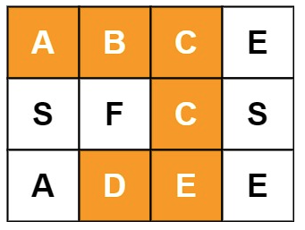

## 题目描述
给定一个m x n 二维字符网格board 和一个字符串单词word 。如果word 存在于网格中，返
回 true ；否则，返回 false 。

单词必须按照字母顺序，通过相邻的单元格内的字母构成，其中“相邻”单元格是那些水平相邻或
垂直相邻的单元格。同一个单元格内的字母不允许被重复使用。

例如，在下面的 3×4 的矩阵中包含单词 "ABCCED"（单词中的字母已标出）。



## 示例1
```
输入：board = [["A","B","C","E"],["S","F","C","S"],["A","D","E","E"]], word = "ABCCED"
输出：true
```
## 示例2
```
输入：board = [["a","b"],["c","d"]], word = "abcd"
输出：false
```
## 方法：回溯法
从board任一点i, j出发，以这个点开始是否能找到单词word。如果能找到，则返回True，否则
返回False。当从i, j出发时，如果i, j对应的值等于此时word中的对应的值，就看i, j周围
是否存在word中的下一个词。为了使得同一个单元格中的字母不能重复使用，我们利用一个visited
数组标记已经使用过的点。
## 代码
```
class Solution:
    def exist(self, board: List[List[str]], word: str) -> bool:
        if board == []:
            return False
        m, n = len(board), len(board[0])
        visited = [[False] * n for _ in range(m)]
        path_len = 0
        for i in range(m):
            for j in range(n):
                if self.has_path(board, word, path_len, i, j, visited, m, n):
                    return True
        return False
    
    def has_path(self, board, word, path_len, i, j, visited, m, n):
        if path_len == len(word):
            return True
        if i >= 0 and i < m and j >= 0 and j < n and word[path_len] == board[i][j] and visited[i][j] == False:
            path_len += 1
            visited[i][j] = True
            is_true = self.has_path(board, word, path_len, i-1, j, visited, m, n) \
                      or self.has_path(board, word, path_len, i+1, j, visited, m, n) \
                      or self.has_path(board, word, path_len, i, j-1, visited, m, n) \
                      or self.has_path(board, word, path_len, i, j+1, visited, m, n)
            if not is_true:
                path_len -= 1
                visited[i][j] = False
            return is_true
        else:
            return False
```